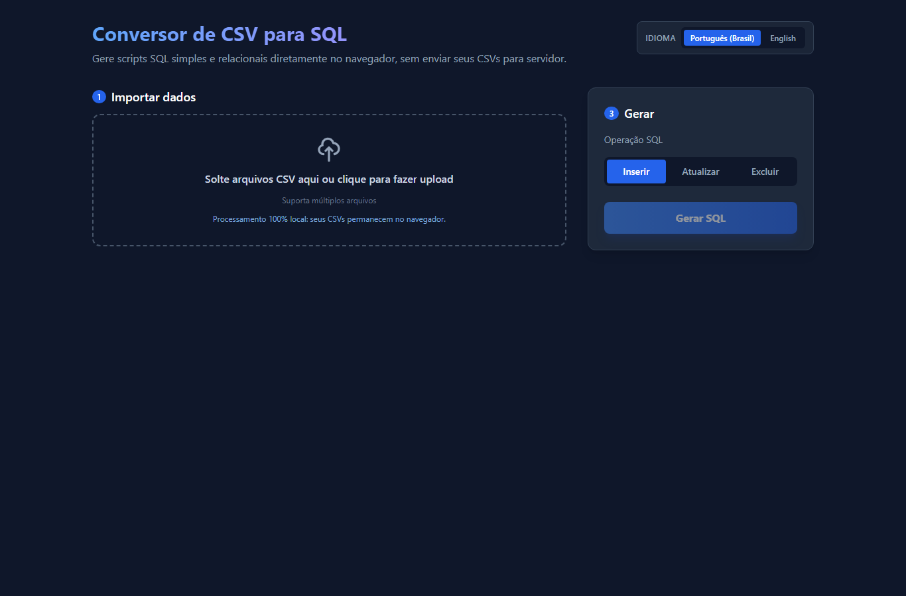
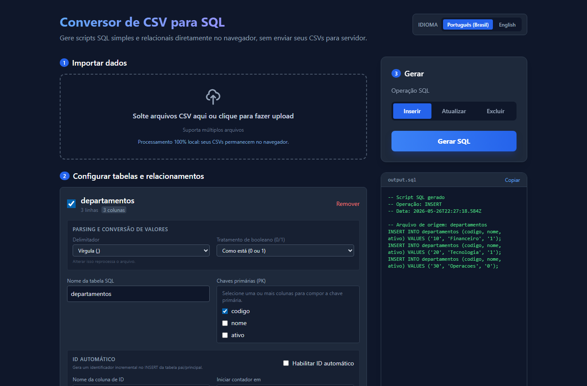
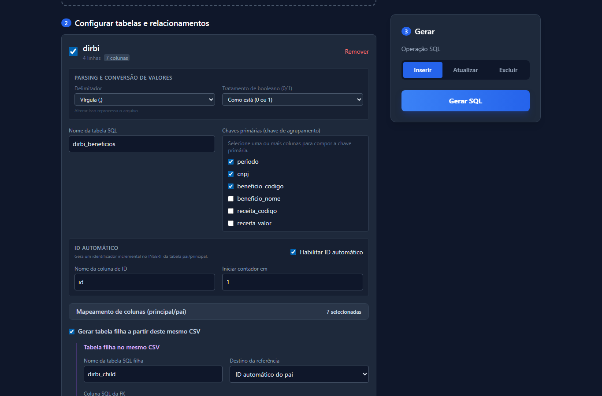

# CSV SQL Converter

Aplicação web em Angular para transformar arquivos CSV em scripts SQL. O projeto roda 100% no navegador, não possui backend e não envia os CSVs para servidor.

O objetivo é demonstrar um fluxo de conversão configurável, incluindo geração SQL simples e relacional, com validações para evitar scripts inconsistentes.

## Destaques

- Processamento 100% client-side.
- Upload de múltiplos arquivos CSV.
- Configuração de delimitador por arquivo.
- Normalização e edição de nomes de tabelas e colunas.
- Seleção de colunas incluídas no SQL.
- Tipagem por coluna: texto, inteiro, decimal e booleano.
- Tratamento configurável de booleanos.
- Geração de `INSERT`, `UPDATE` e `DELETE`.
- Suporte a PK simples e composta.
- Suporte a ID incremental automático.
- Suporte a tabela pai/filha no mesmo CSV.
- Suporte a FK entre arquivos CSV diferentes.
- Validações para bloquear SQL inválido ou inconsistente.
- Geração SQL em Web Worker para não concentrar o trabalho pesado na thread principal.

## Privacidade E Execução Local

Os arquivos CSV são lidos pelo navegador e processados no client-side. Não há API, backend, banco remoto ou upload para terceiros no fluxo de conversão.

Essa decisão simplifica o deploy e preserva a privacidade dos dados usados na demonstração. O projeto gera scripts SQL, mas não executa comandos em banco de dados.

## Demonstração Rápida

Os arquivos de exemplo ficam em [`examples/`](examples/):

- [`departamentos.csv`](examples/departamentos.csv): geração SQL simples.
- [`dirbi.csv`](examples/dirbi.csv): tabela pai e filha a partir do mesmo CSV.
- [`classificacoes-tributarias.csv`](examples/classificacoes-tributarias.csv): FK entre arquivos.
- [`classificacoes-tributarias-invalido.csv`](examples/classificacoes-tributarias-invalido.csv): validação bloqueante de relacionamento.



Roteiro sugerido:

1. Rode o projeto e abra `http://localhost:3000`.
2. Importe `examples/departamentos.csv`.
3. Gere SQL com a configuração padrão para demonstrar o fluxo simples.
4. Importe `examples/dirbi.csv`.
5. Configure a tabela principal como `dirbi_beneficios`.
6. Selecione a PK composta com `periodo`, `cnpj` e `beneficio_codigo`.
7. Habilite o ID automático com coluna `id`.
8. Ative "Gerar tabela filha a partir deste mesmo CSV".
9. Configure a tabela filha como `dirbi_receitas`.
10. Inclua na filha as colunas `receita_codigo`, `receita_valor` e `ativo`.
11. Gere SQL para demonstrar filhos referenciando o pai pelo ID incremental.
12. Importe `examples/classificacoes-tributarias.csv`.
13. Configure a tabela como filha externa de `dirbi.csv`.
14. Mapeie `periodo`, `cnpj` e `beneficio_codigo` para a chave lógica do pai.
15. Gere SQL para demonstrar FK entre arquivos.
16. Repita com `examples/classificacoes-tributarias-invalido.csv` para mostrar a validação bloqueando uma chave sem registro pai correspondente.





## Casos De Uso Documentados

### CSV Simples Para INSERT

Use `departamentos.csv` para mostrar o caminho mais curto: importar, revisar nomes/tipos e gerar `INSERT`.

Configuração recomendada:

- Tabela SQL: `departamentos`.
- PK: `codigo`.
- Tipo de `codigo`: inteiro.
- Tipo de `ativo`: booleano.
- Tratamento booleano: `TRUE/FALSE` ou numérico, conforme o SQL desejado.

### Tabela Pai E Filha No Mesmo CSV

Use `dirbi.csv` quando uma linha do CSV contém dados de duas entidades: a entidade principal do benefício e a entidade filha de receitas vinculadas.

Configuração recomendada:

- Tabela principal: `dirbi_beneficios`.
- PK composta: `periodo`, `cnpj`, `beneficio_codigo`.
- ID automático: habilitado, coluna `id`, início em `1`.
- Tabela filha: `dirbi_receitas`.
- FK da filha: `dirbi_beneficio_id`.
- Colunas da filha: `receita_codigo`, `receita_valor`, `ativo`.
- Tipos: `receita_valor` como decimal e `ativo` como booleano.

Esse fluxo demonstra deduplicação lógica do pai e geração de registros filhos apontando para o pai gerado.

### FK Entre Arquivos Diferentes

Use `classificacoes-tributarias.csv` como tabela filha externa de `dirbi.csv`.

Configuração recomendada:

- Tabela filha: `classificacoes_tributarias`.
- Tabela pai: `dirbi.csv`.
- Mapeamento da chave lógica:
  - `periodo` -> `periodo`
  - `cnpj` -> `cnpj`
  - `beneficio_codigo` -> `beneficio_codigo`
- Destino da referência: ID automático do pai ou PK selecionada do pai, conforme a demo.

Esse fluxo demonstra que a geração pode resolver relacionamentos entre arquivos diferentes antes de montar os `INSERT`.

### Validação Bloqueante

Use `classificacoes-tributarias-invalido.csv` para demonstrar erro de relacionamento. O arquivo contém uma chave que não existe no pai, então a geração deve ser bloqueada e o painel de erros deve indicar que não foi possível encontrar o registro pai.

## Angular Zoneless

O projeto usa Angular 21, standalone components, Signals e detecção de mudanças sem Zone.js. Embora o modo zoneless já seja o padrão para novas aplicações no Angular 21, o bootstrap mantém `provideZonelessChangeDetection()` explícito para deixar a decisão arquitetural visível no projeto de estudo.

O `zone.js` não faz parte das dependências, dos polyfills ou dos testes. Todos os componentes usam `ChangeDetectionStrategy.OnPush` e notificam mudanças por mecanismos reconhecidos pelo Angular:

- Signals lidos nos templates são atualizados com `set()` ou `update()`.
- `computed()` representa estado derivado sem copiar valores entre Signals.
- Eventos de template notificam o Angular automaticamente.
- Promises, timers e mensagens do Web Worker atualizam Signals; é a escrita no Signal, não a API assíncrona, que agenda a renderização.
- O teste `src/zoneless-integration.spec.ts` comprova que um componente `OnPush` é atualizado depois de um timer sem `Zone.js` e sem chamar `detectChanges()` manualmente.

Um padrão incompatível seria alterar uma propriedade comum dentro de `setTimeout`, `Promise` ou callback externo e esperar que a tela fosse atualizada automaticamente. Nesse caso, o estado deve ser exposto como Signal ou a view deve ser notificada com `ChangeDetectorRef.markForCheck()`.

Referências oficiais:

- [Angular sem ZoneJS](https://angular.dev/guide/zoneless)
- [API `provideZonelessChangeDetection`](https://angular.dev/api/core/provideZonelessChangeDetection)

## Arquitetura

Camadas principais:

- `AppComponent`: shell da aplicação.
- `UploadComponent`: entrada de arquivos CSV.
- `TableConfigComponent`: configuração de tabela, colunas, tipos, PKs e relacionamentos.
- `StoreService`: coordenação do estado da aplicação.
- `SqlGenerationService`: ponte entre a UI e o Web Worker.
- `sql-generation.worker.ts`: execução da geração em background.
- `sql-generation.ts`: lógica pura de montagem e validação de SQL.
- `sql-validation.ts`: validações de preflight antes de chamar o worker.

Fluxo resumido:

1. A UI envia arquivos para o `StoreService`.
2. O store faz o parsing do CSV e monta a configuração inicial.
3. O usuário ajusta nomes, tipos, PKs e relacionamentos.
4. O store valida a configuração antes da geração.
5. O `SqlGenerationService` envia um payload serializável ao Web Worker.
6. O worker gera o SQL ou retorna erros/warnings.
7. A UI mostra o SQL gerado ou as validações bloqueantes.

## Decisões Técnicas

- Angular Signals centralizam o estado reativo sem depender de bibliotecas externas de store.
- O modo zoneless evita o patch global de APIs assíncronas feito pelo Zone.js e torna explícitas as notificações que atualizam a interface.
- A geração SQL fica em Web Worker para preservar a responsividade da UI em conversões maiores.
- A lógica principal fica em funções puras para facilitar testes unitários.
- O último SQL válido é preservado quando uma nova geração falha.
- As validações são separadas em preflight e geração para cobrir tanto configuração inválida quanto inconsistências linha a linha.
- O projeto é client-side por privacidade, simplicidade de deploy e facilidade de demonstração.

## Limitações Conhecidas

- O projeto gera scripts SQL, mas não executa SQL.
- Não há backend, banco de dados ou persistência remota.
- Upload e parsing inicial do CSV ainda rodam no fluxo principal; o Web Worker cobre a geração SQL.
- Arquivos muito grandes dependem da memória disponível no navegador.
- O SQL gerado é genérico e pode exigir pequenos ajustes para dialetos específicos.
- A configuração é manual por sessão; ainda não há salvamento de presets.
- A validação evita inconsistências comuns, mas não substitui validação final contra o schema real do banco.

## Como Rodar

Pré-requisitos:

- Node.js `^20.19.0`, `^22.13.0` ou `>=24.0.0`.
- npm 8 ou mais recente.

Com NVM, use a versão registrada no projeto:

```bash
nvm use
```

Instale as dependências:

```bash
npm install
```

Rode em desenvolvimento:

```bash
npm run dev
```

Abra:

```text
http://localhost:3000
```

Build de produção:

```bash
npm run build
```

Testes:

```bash
npm test
```

Validação completa, incluindo lint, testes e build:

```bash
npm run check
```

No Windows PowerShell, caso `npm.ps1` esteja bloqueado pela política de execução, use:

```bash
npm.cmd test
npm.cmd run build
```

## Validação Do Projeto

Antes de publicar ou gravar uma demo, rode:

```bash
npm.cmd test
npm.cmd run build
```

O GitHub Actions executa instalação reproduzível com `npm ci`, auditoria das dependências de runtime, lint, testes e build em pushes e pull requests.

Validação manual recomendada:

- Abrir `http://localhost:3000`.
- Reproduzir o roteiro com os CSVs de `examples/`.
- Confirmar geração SQL simples.
- Confirmar geração pai/filha no mesmo CSV com PK composta e ID incremental.
- Confirmar FK entre arquivos.
- Confirmar que o CSV inválido bloqueia a geração e preserva o último SQL válido.

## Capturas Para Portfólio

As imagens em `docs/assets/` foram geradas a partir do app rodando localmente:

- `01-upload.png`: tela inicial com mensagem de processamento local.
- `02-simple-sql.png`: SQL simples gerado a partir de `departamentos.csv`.
- `03-parent-child-config.png`: configuração pai/filha de `dirbi.csv`.
- `04-external-fk.png`: relacionamento entre `dirbi.csv` e `classificacoes-tributarias.csv`.
- `05-validation-error.png`: erro bloqueante preservando o último SQL válido.

Para LinkedIn, um GIF curto deve focar no fluxo principal: importar CSV, ajustar relacionamento, gerar SQL e mostrar uma validação bloqueante.

## Licença

Distribuído sob a licença MIT. Consulte [`LICENSE`](LICENSE).
